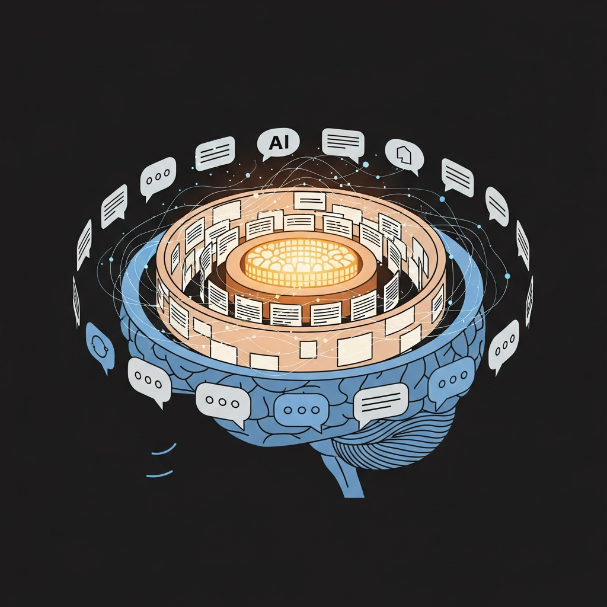
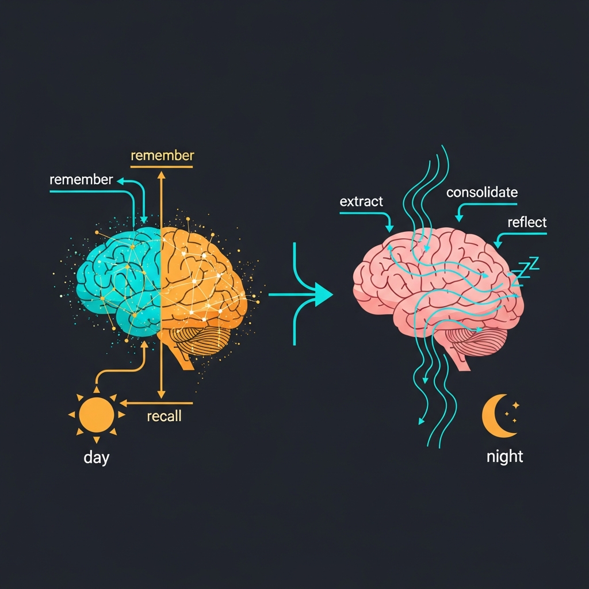

# Giving Claude Code a Memory That Outlives the Session



Every Claude Code session starts from scratch. Your AI assistant is brilliant for the next two hours, then forgets everything. It doesn't remember that you prefer `bun` over `npm`, that you settled a database schema debate last Tuesday, or that a particular debugging approach saved you an hour on a gnarly race condition.

I wanted something different: an AI **teammate** — one that remembers, learns, and evolves.

## The Design

The core idea is borrowed from cognitive science (and [Letta/MemGPT](https://github.com/letta-ai/letta)): separate memory into tiers, and let a "sleep" process consolidate what was learned.

**Three memory tiers:**

| Tier | Always loaded? | Purpose |
|------|---------------|---------|
| Core | Yes (via `@import`) | Key decisions, proven patterns, critical preferences |
| Archival | Searched on demand | Session insights, observed patterns, debugging discoveries |
| Recall | Searched on demand | Session summaries, open threads |

Each memory block is a markdown file with YAML frontmatter — type, confidence score, tags, timestamps. Git-friendly, human-readable, Claude-native.

## Two Memory Loops



**Active (during a session):** The teammate fires background agents to `remember` decisions and `recall` prior context — the same way you might jot a note or check your own notes mid-conversation.

**Passive (after a session):** A SessionEnd hook triggers "sleep-time compute" — three agents that run sequentially:

1. **Extract** — scans the session transcript for memories the active loop missed
2. **Consolidate** — merges duplicates, applies confidence decay, promotes strong memories to core, prunes stale ones
3. **Reflect** — evolves the teammate's relationship file and (rarely) its personality

Confidence decay is the secret sauce. Decisions decay slowly (0.01/week). Insights decay fast (0.05/week). Facts never decay. Anything below 0.3 gets pruned. The memory store stays lean without manual curation.

## The Build

The whole thing is pure markdown and shell — no TypeScript runtimes, no databases, no API keys beyond Claude itself.

```
skills/team-memory/
├── SKILL.md                    # Skill definition + commands
├── scripts/
│   ├── init.sh                 # Bootstrap ~/.ai-memory/<name>/
│   └── launch.sh               # Thin launcher with --add-dir
├── agents/
│   ├── remember.md             # Write memory blocks (background)
│   ├── recall.md               # Search memories (background)
│   ├── sleep.md                # Orchestrator
│   ├── sleep-extract.md        # Extract from transcript
│   ├── sleep-consolidate.md    # Merge, decay, promote/demote
│   └── sleep-reflect.md        # Evolve personality
└── templates/                  # Starter files for new teammates
```

`init.sh` bootstraps a new teammate in `~/.ai-memory/<name>/`, copies templates, creates the directory hierarchy, and wires a conditional SessionEnd hook into `settings.json`. The hook only fires when launched through the memory launcher (which sets `$AI_MEMORY_PERSONA`).

`launch.sh` is a thin wrapper that sets env vars and calls `claude --add-dir` to load the teammate's CLAUDE.md (with its `@import` chain of personality, relationship, and core memories) into the system prompt.

## Personality That Evolves

Each teammate has a `personality.md` with immutable and mutable sections. The human defines identity and values (immutable). Voice, strengths, and growth reflections evolve through the sleep-reflect agent. Changes are subtle and incremental — personality doesn't shift overnight.

There's also a `relationship.md` that tracks communication style, rapport, shared history, and working patterns. This updates after almost every session.

## Getting Started

```bash
# Bootstrap a teammate
bash ~/.claude/skills/team-memory/scripts/init.sh bertram

# Edit personality
vim ~/.ai-memory/bertram/personality.md

# Launch
~/.claude/skills/team-memory/scripts/launch.sh --persona bertram
```

After a few sessions, check `~/.ai-memory/bertram/archival/` — you'll find a growing collection of things your teammate learned about your projects, preferences, and patterns. Things it will remember next time.

---

*Built as a Claude Code skill. The full implementation lives at [github.com/mfairchild365/.claude](https://github.com/mfairchild365/.claude) in `skills/team-memory/`.*
