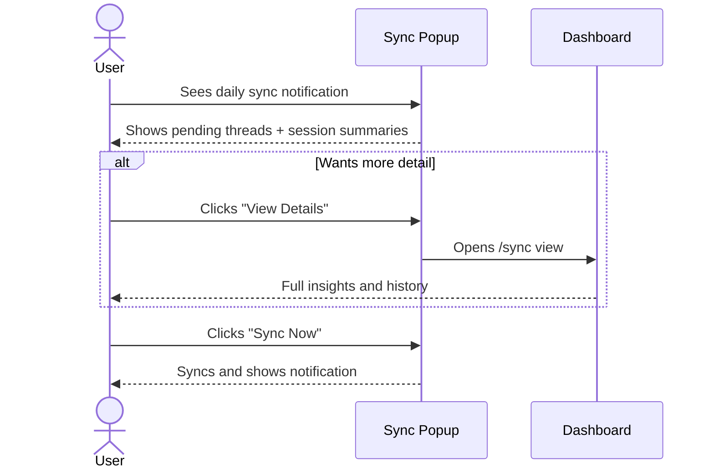
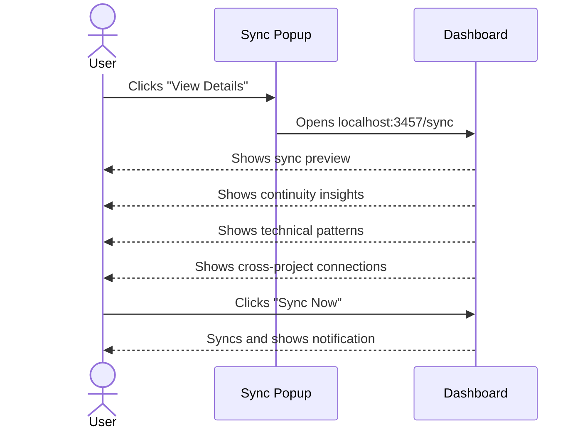
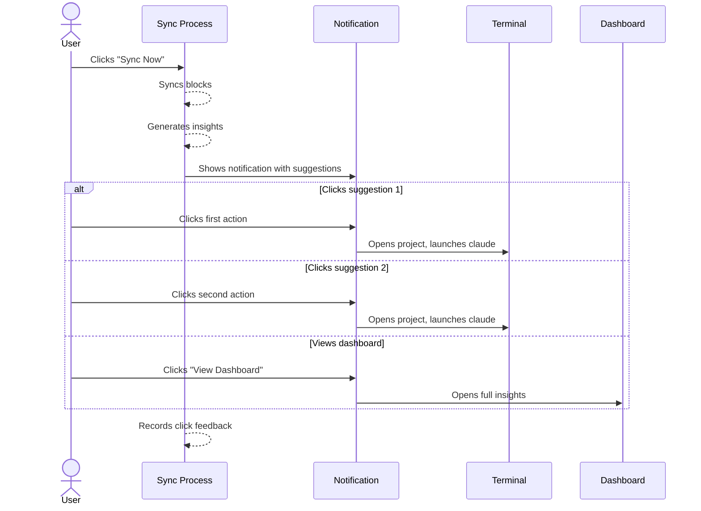

# Chronicle Sync UX User Stories

## Product Context

Chronicle captures session context automatically. The sync UX enhancement transforms the daily sync prompt from a mechanical confirmation into a momentum tool that shows pending work, surfaces insights, and suggests actionable next steps.

---

## Story 1: Daily Sync Decision

**As a** developer starting my day
**I want to** see what unfinished work is waiting and what I accomplished
**So that** I can decide whether to sync and what to work on next

### Flow Diagram



### ASCII Wireframe

```
┌─────────────────────────────────────────────┐
│  Chronicle Sync                         [x] │
├─────────────────────────────────────────────┤
│  3 sessions ready to sync                   │
│                                             │
│  ⚡ PENDING THREADS                         │
│  • auth-refactor: "needs token refresh"     │
│  • api-v2: "blocked on schema decision"     │
│                                             │
│  📝 RECENT SESSIONS                         │
│  • chronicle-sync-ux brainstorm             │
│  • dashboard bug fix                        │
│  • api endpoint cleanup                     │
│                                             │
│  Last sync: 2 days ago                      │
│                                             │
│  [View Details]  [Later]  [Sync Now]        │
└─────────────────────────────────────────────┘
```

### Steps

1. **Popup appears** — Daily launchd trigger shows enhanced sync dialog
2. **Review pending** — User scans pending threads and sessions
3. **Decide** — Click Sync Now, Later, or View Details

---

## Story 2: Exploring Insights Before Sync

**As a** developer who wants context before syncing
**I want to** see patterns and insights from my recent sessions
**So that** I understand what Chronicle has learned

### Flow Diagram



### ASCII Wireframe

```
┌──────────────────────────────────────────────────────────────┐
│  Chronicle Dashboard                    [Sync Now] [Settings]│
├──────────────────────────────────────────────────────────────┤
│                                                              │
│  📊 SYNC PREVIEW                          Last sync: Jan 22  │
│  ┌────────────────────────────────────────────────────────┐  │
│  │ 3 sessions • 2 projects • 8 files changed              │  │
│  └────────────────────────────────────────────────────────┘  │
│                                                              │
│  ⚡ CONTINUITY INSIGHTS                                      │
│  ┌────────────────────────────────────────────────────────┐  │
│  │ • auth-refactor spans 4 sessions (Jan 20-24)           │  │
│  │ • 2 pending threads resolved since last sync           │  │
│  │ • api-v2 blocked for 3 days - needs attention          │  │
│  └────────────────────────────────────────────────────────┘  │
│                                                              │
│  🔧 TECHNICAL PATTERNS                                       │
│  ┌────────────────────────────────────────────────────────┐  │
│  │ • src/auth/* modified in 80% of recent sessions        │  │
│  │ • Tech debt: error handling in api/routes.ts           │  │
│  └────────────────────────────────────────────────────────┘  │
│                                                              │
│  🔗 CROSS-PROJECT                                            │
│  ┌────────────────────────────────────────────────────────┐  │
│  │ • Similar auth patterns in dotclaude and webapp        │  │
│  └────────────────────────────────────────────────────────┘  │
└──────────────────────────────────────────────────────────────┘
```

### Steps

1. **Open dashboard** — Click "View Details" from popup
2. **Review insights** — Scan continuity, technical, cross-project sections
3. **Check history** — Scroll to see past sync timeline
4. **Sync** — Click "Sync Now" when ready

---

## Story 3: Acting on Post-Sync Suggestions

**As a** developer who just synced
**I want to** see what I should work on next
**So that** I can maintain momentum without deciding from scratch

### Flow Diagram



### ASCII Wireframe

```
┌─────────────────────────────────────────┐
│ 🔄 Chronicle Synced                     │
├─────────────────────────────────────────┤
│ 3 sessions synced                       │
│ ✓ 2 pending threads resolved            │
│                                         │
│ 💡 SUGGESTED ACTIONS                    │
│                                         │
│ [1] Resume "api-v2" - blocked 3 days    │
│     ~/code/api-v2                       │
│                                         │
│ [2] Continue auth-refactor pattern      │
│     ~/code/dotclaude                    │
│                                         │
│              [View Dashboard]           │
└─────────────────────────────────────────┘
```

### Steps

1. **See notification** — Post-sync notification appears with suggestions
2. **Evaluate options** — Two prioritized suggestions shown
3. **Take action** — Click to launch Claude in suggested project
4. **Feedback captured** — System records which suggestion was clicked (or neither)

---

## Story 4: Reviewing Sync History

**As a** developer checking my productivity
**I want to** see my sync history and what insights were generated
**So that** I understand my work patterns over time

### ASCII Wireframe

```
┌──────────────────────────────────────────────────────────────┐
│  📅 SYNC HISTORY                                             │
│  ┌────────────────────────────────────────────────────────┐  │
│  │ Today      │ 3 sessions │ pending  │ -                 │  │
│  │ Jan 22     │ 5 sessions │ ✓ synced │ 3 insights        │  │
│  │ Jan 20     │ 2 sessions │ ✓ synced │ 1 thread resolved │  │
│  │ Jan 18     │ 4 sessions │ ✓ synced │ new pattern found │  │
│  │ Jan 15     │ 6 sessions │ ✓ synced │ tech debt flagged │  │
│  └────────────────────────────────────────────────────────┘  │
└──────────────────────────────────────────────────────────────┘
```

### Steps

1. **Open dashboard** — Navigate to localhost:3457/sync
2. **Scroll to history** — View past syncs with highlights
3. **Click entry** — Expand to see full details of that sync
