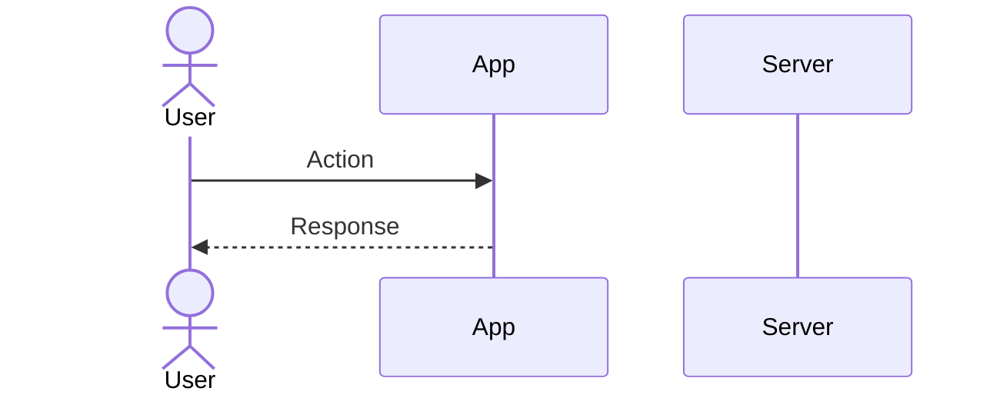
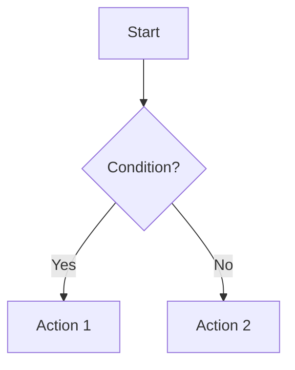

# Brainstorm Board

Three-phase design workflow: document the product, map user stories, then generate visual mockups.

## Phase Overview

```
Phase 1: PRODUCT OVERVIEW → docs/product_overview.md
         High-level product purpose, problem, solution

Phase 2: USER STORIES    → docs/user-stories.md
         Key flows with Mermaid diagrams and ASCII art

Phase 3: VISUAL MOCKUPS  → docs/design/brainstorm/
         AI-generated screens per story step
```

---

## Phase 1: Product Overview

Create `docs/product_overview.md` - the canonical product definition.

**Contents:**
- Problem statement (what pain exists)
- Solution summary (how the product solves it)
- Core capabilities (bulleted feature list)
- User workflows (how people use it)
- Design principles (guiding constraints)
- Target users (who benefits)

**Key rule:** No implementation details. Focus on *what* and *why*, not *how*.

---

## Phase 2: User Stories

Create `docs/user-stories.md` - standalone document with flows and diagrams.

### Structure

```markdown
# [Product] User Stories

## Product Context
[2-3 sentences - enough to understand stories without reading full docs]

---

## Story 1: [Title]

**As a** [user type]
**I want to** [action]
**So that** [benefit]

### Flow Diagram

\`\`\`mermaid
sequenceDiagram
    actor User
    participant App
    User->>App: Opens app
    App-->>User: Shows map
    User->>App: Taps + button
    ...
\`\`\`

### ASCII Wireframe

\`\`\`
┌─────────────────────────┐
│  Waterworks        [+]  │
├─────────────────────────┤
│                         │
│    ┌───┐                │
│    │ ● │  Well marker   │
│    └───┘                │
│         ┌───┐           │
│         │ ▢ │  Tank     │
│         └───┘           │
│                         │
├─────────────────────────┤
│  [● Online]             │
└─────────────────────────┘
\`\`\`

### Steps

1. **[Step name]** - [What happens]
2. **[Step name]** - [What happens]
3. ...
```

### Diagram Types

**Mermaid sequence** - for user interactions:


**Mermaid flowchart** - for decision trees:


**ASCII wireframes** - for layout concepts:
```
┌────────────────────┐
│ Header       [btn] │
├────────────────────┤
│ Content area       │
│                    │
├────────────────────┤
│ [Tab1] [Tab2]      │
└────────────────────┘
```

---

## Phase 3: Visual Mockups

Generate AI mockups for each story step. Two approaches:

### A. Screen Exploration (assets/index.html)

For exploring independent screen concepts:
- Uses `assets/index.html` template
- Gallery layout with ratings
- Good for: early exploration, multiple options

### B. Story Flow (assets/stories.html)

For sequential user story visualization:
- Uses `assets/stories.html` template
- Step-by-step flow with connectors
- Good for: walkthrough documentation, continuity

---

## Image Generation

### Provider Options

| Provider | Model | Best For |
|----------|-------|----------|
| Google Imagen 4 | imagen-4.0-generate-001 | Independent screens |
| OpenAI | gpt-image-1.5 | Sequential flows (continuity) |
| fal.ai Flux | flux-pro | Fast iteration |

At least one provider required via API key (`GOOGLE_API_KEY`, `OPENAI_API_KEY`, or `FAL_KEY`).

### OpenAI Continuity for Story Flows

For consistent screens across a user story, use OpenAI gpt-image-1.5 with image editing:

**Step 1 (establish style):**
```python
from openai import OpenAI
client = OpenAI()

# First screen - establish visual style
response = client.images.generate(
    model="gpt-image-1.5",
    prompt="Mobile app UI mockup: [detailed style description]. Clean iOS style, blue accent color, white background, system font.",
    size="1024x1536"
)
# Save as story1/01-step.png
```

**Step 2+ (reference previous):**
```python
import base64

# Read previous image
with open("story1/01-step.png", "rb") as f:
    prev_image = base64.standard_b64encode(f.read()).decode("utf-8")

# Edit with reference to previous
response = client.images.edit(
    model="gpt-image-1.5",
    image=[{"type": "base64", "media_type": "image/png", "data": prev_image}],
    prompt="Same app, same visual style. Now showing: [describe changes]. Keep header, colors, typography identical.",
)
# Save as story1/02-step.png
```

**Key parameters:**
- `action: "edit"` - force edit mode (vs generate)
- `input_fidelity: "high"` - preserve more of input style

**Prompt tips for continuity:**
- Reference specific UI elements: "same blue header", "same card style"
- Describe only what changed: "bottom sheet now open"
- Include style anchors: "iOS 17 style", "material design 3"

### Google Imagen (if-gen skill available)

```bash
uv run ~/.claude/skills/image-gen/scripts/generate_imagen.py \
  --prompt "Mobile app UI mockup: [description]" \
  --output path/to/mockup.png
```

---

## Directory Structure

```
project/docs/
├── product_overview.md       # Phase 1
├── user-stories.md           # Phase 2
└── design/
    └── brainstorm/
        ├── index.html        # Screen exploration
        ├── stories.html      # Story flows
        ├── 01-screen.png     # Independent screens
        ├── story1/           # Story 1 flow
        │   ├── 01-step.png
        │   ├── 02-step.png
        │   └── ...
        └── v1/               # Archived versions
```

---

## Feedback Workflow

### Screen Exploration (C → A → B)

1. **CLARIFY** - Ask about unclear feedback
2. **CONFIRM** - Summarize understanding
3. **ITERATE** - Generate refined mockups

### Story Flow Review

1. Review story progression for logic gaps
2. Check visual continuity across steps
3. Validate that UI supports each action

---

## Quick Start

```bash
# Phase 1
# Create docs/product_overview.md

# Phase 2
# Create docs/user-stories.md with Mermaid diagrams

# Phase 3
mkdir -p docs/design/brainstorm/story1
cp ~/.claude/skills/brainstorm-board/assets/stories.html docs/design/brainstorm/
# Generate images, customize HTML
```

---

## Resources

### assets/index.html
Screen exploration template with dark mode, collapsible context, ratings, feedback summary.

### assets/stories.html
Story flow template with step-by-step layout, story navigation, generation prompts.

Sources:
- [OpenAI Image Generation Docs](https://platform.openai.com/docs/guides/image-generation)
- [GPT Image 1.5 Announcement](https://siliconangle.com/2025/12/16/openai-launches-new-gpt-image-1-5-model-optimized-image-editing/)
