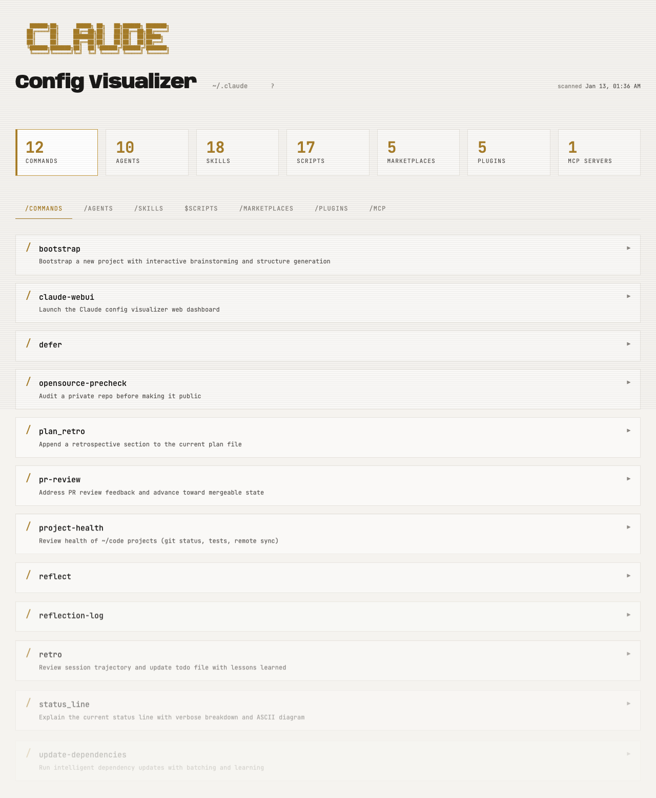

# Claude Config Visualizer

A terminal-inspired web dashboard for visualizing your `~/.claude` configuration.



## Features

- **Commands** - Custom slash commands with descriptions and content preview
- **Agents** - Agent definitions with model, color, and tool configurations
- **Skills** - Skills with script/reference/asset indicators
- **Marketplaces** - Known plugin marketplaces
- **Plugins** - Installed plugins with scope and version info
- **MCP Servers** - Model Context Protocol server configurations

## Prerequisites

- [Bun](https://bun.sh) runtime

## Usage

### 1. Scan your configuration

```bash
bun scan.ts
```

This reads `~/.claude/` and generates `data.json` with your current configuration.

### 2. Start the server

```bash
bun serve.ts
```

Open http://localhost:3000 in your browser.

## Testing

Run the E2E tests (also regenerates screenshots):

```bash
bunx playwright test
```

## Architecture

```
webui/
├── index.html      # Single-page app (inline CSS/JS)
├── scan.ts         # Config scanner → data.json
├── serve.ts        # Static file server
├── e2e.test.ts     # Playwright tests
└── screenshots/    # Documentation images
```

The UI uses vanilla JavaScript with a terminal-inspired aesthetic featuring:
- JetBrains Mono typography
- Dark/light mode (follows system preference)
- Scanline overlay effect
- Staggered card animations

## Data Sources

The scanner reads from:
- `~/.claude/commands/*.md` - Command definitions
- `~/.claude/agents/*.md` - Agent configurations
- `~/.claude/skills/` - Skill directories and `.skill` files
- `~/.claude/plugins/known_marketplaces.json` - Marketplace registry
- `~/.claude/plugins/installed_plugins.json` - Plugin installations
- `~/.claude/.mcp.json` - MCP server configurations
